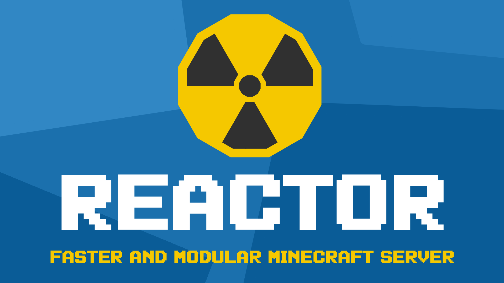

# Reactor
An open-source Minecraft server written in Java.

## How does it work?
You don’t need to compile your own server (like Minestom) or deal with unnecessary features that come with other servers (such as Paper, Spigot, or the vanilla Minecraft server).

With Reactor, you decide which features to add to your server. This makes it more lightweight and scalable. For example, if you need a lobby, you only add chat, NPCs, and a lobby core plugin—without extra features like combat, entity AI, world generation, and others.

Every feature is provided as an external plugin—chat, NPCs, entity AI, world generation, combat, etc.
However, unlike Minestom, these plugins are already coded for you, so you don’t have to develop every feature yourself—just add the plugin.

## Why Reactor?
Spigot servers contain poorly written code, full of memory leaks and bad practices.
What about Minestom? It’s not a bad alternative, but you have to code everything yourself.

These are the main reasons for creating Reactor: a well-structured, high-performance server focused on a modular system based on plugins and events.

> [!WARNING]
> This project is in heavy development.
> 
> It is not ready for production.